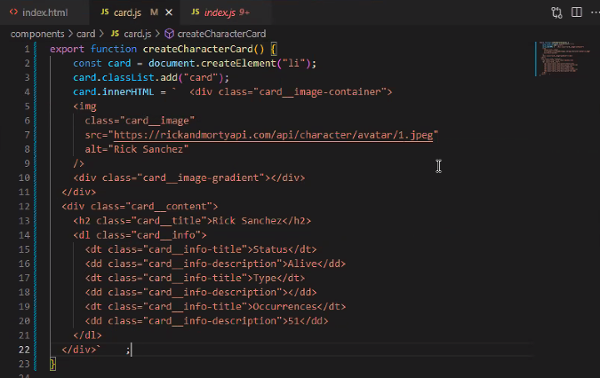

# Recap-Project-3

#### Contributors: Ella, Christoph, Manu, Stephan

##### 10:00 - 10:30 Projektbesprechung

##### 10:30 - 12:45 Card Component
  - Teamarbeit
  - "createElement" mit innerHTML 
    
    - [JS create element](https://github.com/neuefische/cgn-web-23-1/blob/main/sessions/js-createelement/js-createelement.md)

  - HTML ausgelagert in Card.js
  - Card Basic Function

  - Fetch Character

    - [JS Fetch](https://github.com/neuefische/cgn-web-23-1/blob/main/sessions/js-fetch/js-fetch.md)
    - [JS Async Function](https://github.com/neuefische/cgn-web-23-1/blob/main/sessions/js-async-functions/js-async-functions.md)

##### 14:40 - 15:15 Pagination

  - Next Button
  - Set max page
  - Eventlistener

  - Previous Button
  - Pagination Page Number

